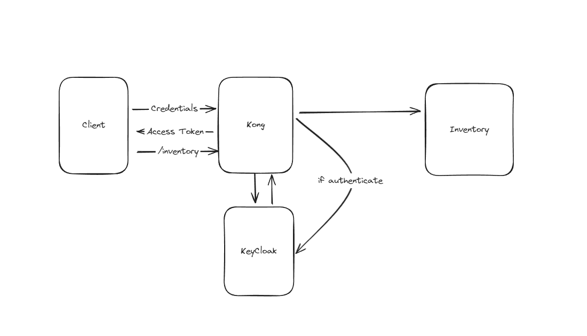
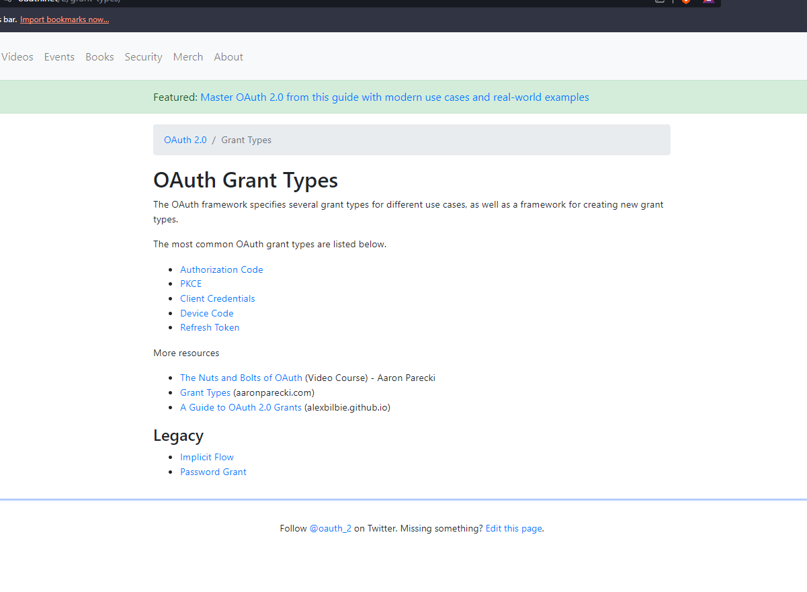
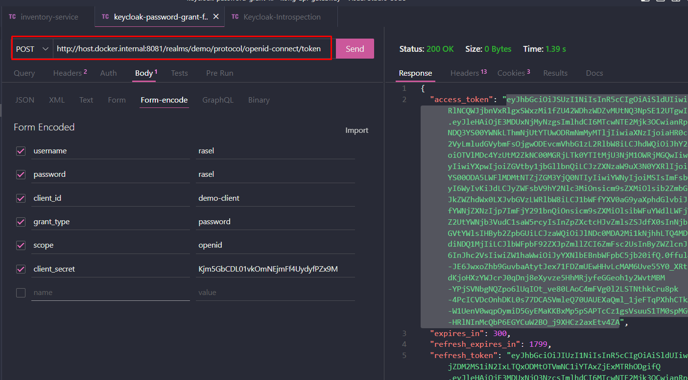
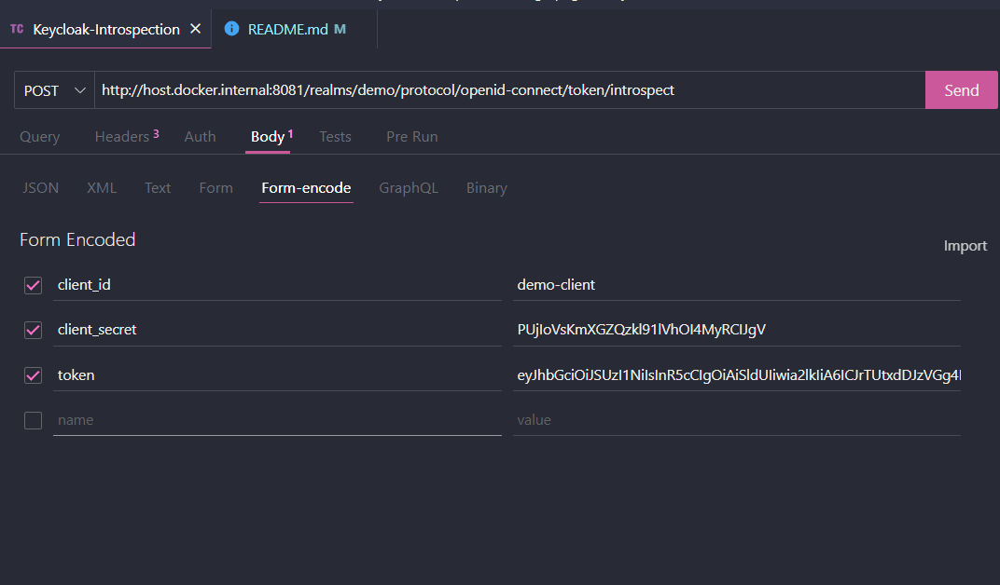

# kong-api-getaway



- [Keycloak Docs Distribution 21.0.1 API](https://www.keycloak.org/docs-api/21.0.1/javadocs/index.html)

- [Vie All Free Service of Kong 🦍](https://docs.konghq.com/hub/?tier=free)


## Create a ssl certificate with letsencrypt

> it will create localhostcrt.pem and localhostkey.pem for a ssl certificate for localhost

- [Lets Encrypt for fake cert and key file](https://letsencrypt.org/docs/certificates-for-localhost/)

- [keycloak tls](https://www.keycloak.org/server/enabletls)

```bash
openssl req -x509 -out localhostcrt.pem -keyout localhostkey.pem \
  -newkey rsa:2048 -nodes -sha256 \
  -subj '/CN=localhost' -extensions EXT -config <( \
   printf "[dn]\nCN=localhost\n[req]\ndistinguished_name = dn\n[EXT]\nsubjectAltName=DNS:localhost\nkeyUsage=digitalSignature\nextendedKeyUsage=serverAuth")
```
- [http keycloak on 8081 port](http://localhost:8081/)

- [https keycloak on 8445](https://localhost:8445/)


# [Oauth Grant Types](https://oauth.net/2/grant-types/)



## Keycloak Token EndPoint : http://host.docker.internal:8081/realms/demo/protocol/openid-connect/token


## Keycloak Introspection EndPoint : http://host.docker.internal:8081/realms/demo/protocol/openid-connect/token/introspect




-------------------
http://localhost:8081/realms/demo/protocol/openid-connect/auth?client_id=demo-client&redirect_uri=http://your-app-page&response_mode=fragment&response_type=code&scope=openid&nonce=9165368a-b370-4afb-8379-ed8ec7b11b73&code_challenge=Vv1dGUWyk9gUcGuzWIH32-hVZru-uVlCMqEaluKfTVA&code_challenge_method=S256


